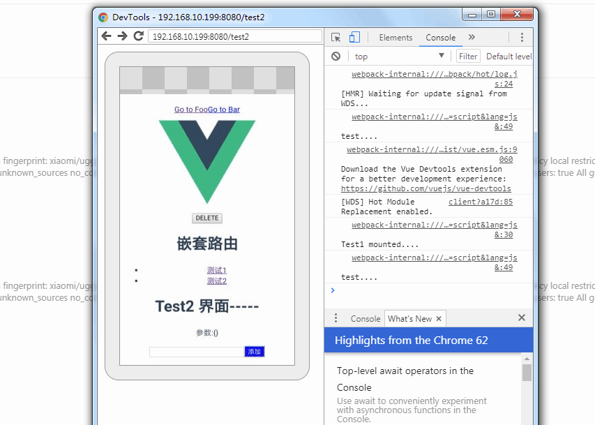

# typescript In react Native

https://github.com/Microsoft/TypeScript-React-Native-Starter

https://github.com/techird/blog/issues/3

## first

```
yarn add --dev typescript
yarn add --dev react-native-typescript-transformer
yarn tsc --init --pretty --jsx react
touch rn-cli.config.js
yarn add --dev @types/react @types/react-native
```

## second

tsconfig.json 文件下解开**allowSyntheticDefaultImports**的 注释

```
{
  ...
  // "allowSyntheticDefaultImports": true,  /* Allow default imports from modules with no default export. This does not affect code emit, just typechecking. */
  ...
}
```

## third

rn-cli.config.js 文件下添加

```
module.exports = {
  getTransformModulePath() {
    return require.resolve("react-native-typescript-transformer");
  },
  getSourceExts() {
    return ["ts", "tsx"];
  }
};
```

## Migrating to TypeScript

Rename the generated `App.js` and `__tests__/App.js` files to `App.tsx`. `index.js` needs to use the `.js` extension. All new files should use the `.tsx` extension (or `.ts` if the file doesn't contain any JSX).

If you try to run the app now, you'll get an error like `object prototype may only be an object or null`. This is caused by a failure to import the default export from React as well as a named export on the same line. Open `App.tsx` and modify the import at the top of the file:

**重新命名生成的 App.js 文件为 App.tsx ,而 index.js 需要用.js 扩展名,此后全部的文件应该使用 .tsx 或者.ts 并且该文件中不包含 JSX**

## Simple example

App.js

```tsx
/**
 * Sample React Native App
 * https://github.com/facebook/react-native
 * @flow
 */

import React, { Component } from "react";
import { Platform, StyleSheet, Text, View } from "react-native";
import Hello from "./src/Hello";

type Props = {};
export default class App extends Component<Props> {
  render() {
    return (
      <View style={styles.container}>
        <Hello name="hengcheng" />
      </View>
    );
  }
}

const styles = StyleSheet.create({
  container: {
    flex: 1,
    justifyContent: "center",
    alignItems: "center",
    backgroundColor: "#F5FCFF"
  },
  welcome: {
    fontSize: 20,
    textAlign: "center",
    margin: 10
  },
  instructions: {
    textAlign: "center",
    color: "#333333",
    marginBottom: 5
  }
});
```

Hello.tsx

```tsx
// components/Hello.tsx
import React from "react";
import { Button, StyleSheet, Text, View } from "react-native";

export interface Props {
  name: string;
}

interface State {}

export default class Hello extends React.Component<Props, State> {
  constructor(props: Props) {
    super(props);
  }

  render() {
    return (
      <View>
        <Text>{this.props.name}</Text>
        <Text>Test Typescript....</Text>
      </View>
    );
  }
}
```

关于编辑器不提示样式的问题解决方法

https://github.com/Microsoft/vscode-react-native/issues/379

封装公共的 styleSheet

```ts
import {
  StyleSheet as RnStyleSheet,
  ViewStyle,
  TextStyle,
  ImageStyle
} from "react-native";

type StyleProps = Partial<ViewStyle | TextStyle | ImageStyle>;

const StyleSheet = {
  create(styles: { [className: string]: StyleProps }) {
    return RnStyleSheet.create(styles);
  },
  hairlineWidth: RnStyleSheet.hairlineWidth
};

export default StyleSheet;
```

## Question

### 1.真机 dedug remote js 调试红屏幕报错

**react native dedug remote js getDeviceId:Neither user 10645**

解决:进入应用授权界面,给所有的权限添加允许

## typescript 封装的简单例子

```tsx
import React from "react";
import {
  TouchableOpacity,
  ActivityIndicator,
  ViewStyle,
  TextStyle,
  StyleSheet
} from "react-native";
/*
  声明传入组件的属性接口....
*/
interface ButtonProp {
  text: string;
  width?: number; //可选
  disabled?: boolean;
  waiting?: boolean;
  style?: ViewStyle | ViewStyle[]; //样式,ViewStyle //或者ViewStyle类型数组
  textStyle?: TextStyle;
  onPress?: () => void;
}
/*
	声明纯组件 :React.SFC
	
*/
export const BorderButton: React.SFC<ButtonProp> = ({
  text,
  disabled,
  waiting,
  style,
  textStyle,
  onPress,
  width = WINDOW.WIDTH - 2 * STYLE_SIZE.SPACING_XW
}) => (
  <TouchableOpacity
    disabled={disabled || waiting}
    onPress={onPress}
    activeOpacity={0.6}
    style={[
      styles.buttonBase,
      { width },
      styles.borderBtn,
      style,
      disabled ? styles.borderDisabled : null
    ]}
  >
    {waiting ? (
      <ActivityIndicator
        size={STYLE_SIZE.FONT_BUTTON_TEXT}
        color={STYLE_COLOR.THEME_BLUE}
      />
    ) : (
      <MText style={[styles.borderText, textStyle]}>{text}</MText>
    )}
  </TouchableOpacity>
);
```

## VSCode 插件

https://zhuanlan.zhihu.com/p/54067071

## Prettier

https://segmentfault.com/a/1190000015315545

// private static host: string = 'http://local.ck.com';

http://graphql.cn/

## react-native-config

全局配置变量,原生皆可使用,在项目中用来控制添加的版本号

https://github.com/luggit/react-native-config

## react-native-DatePicker

https://github.com/xgfe/react-native-datepicker

spinner 模式显示不一致

https://github.com/xgfe/react-native-datepicker/issues/231

手动调用

```
use:
<DatePicker
showIcon={false}
hideText={true}
ref={(ref)=>this.datePickerRef=ref}
...
/>

and from your element:
onPress={() => this.datePickerRef.onPressDate()
```

https://www.jianshu.com/p/6700e0422e6e

## 装饰器

**它的主要作用是给一个已有的方法或类扩展一些新的行为，而不是去直接修改它本身。**

在项目中的使用例子 :

```react
/*
  this.props.navigation.navigate('test',{name:'hengcheng'})
*/
import { withMappedNavigationProps } from 'react-navigation-props-mapper';
@withMappedNavigationProps()
class Test extends Component {
    /*  this.props.navigation.state.params.name  */
    render(){
        return (<View><Text>{this.props.name}</Text></View>)
    }
}
```

还有有个 ant-design-pro 里面的表单注解也有使用到,更方便的操作表单,并获取每个表单组的值

https://zhuanlan.zhihu.com/p/30487077

https://aotu.io/notes/2016/10/24/decorator/index.html

https://segmentfault.com/p/1210000008917067/read

## 修改 git 本地的账号

https://blog.csdn.net/autoliuweijie/article/details/52230165

```
查看
git config user.name
git config user.email
修改
git config --global user.name "username"
git config --global user.email "email"
```

## git

https://segmentfault.com/a/1190000018688048

我从 master 拉取了一个新的开发分支，我想每天把 master 分支上其它人的提交同步到我的开发分支，应该怎么做呢?

```
 git rebase master  // 意思是当前的分支建立在master之上
```

经常有这样的事情发生，当你正在进行项目中某一部分的工作，里面的东西处于一个比较杂乱的状态，而你想转到其他分支上进行一些工作。问题是，你不想提交进行了一半的工作，否则以后你无法回到这个工作点。解决这个问题的办法就是`git stash`命令。

```
git stash  //  vscode 有储藏这一选项
git stash list  // 查看储藏列表
git stash apply  // 运用最新的储藏
git stash drop name   // 删除某个储存
```

https://www.jianshu.com/p/4a8f4af4e803

```
关于 rebase 和 merge
关于什么时候使用 rebase，什么时候使用 merge，开发者总结了几条规则：

从 remote 分支拉取更新到本地时，使用 rebase。
当完成 bug 修复或新功能时，使用 merge 将子分支合并到主分支。
没有人应该 rebase 一根共享的分支。
```

https://www.cnblogs.com/Sinte-Beuve/p/9195018.html

https://zhuanlan.zhihu.com/p/34197548

## LayoutAnimation API

https://segmentfault.com/a/1190000014682665

React 中禁止页面滚动

https://segmentfault.com/a/1190000018598630

https://segmentfault.com/a/1190000018144698

FLex 布局深入理解

https://segmentfault.com/a/1190000017826957

https://segmentfault.com/a/1190000014619371

ALlibaba 图表可视化

## bizcharts

https://github.com/alibaba/BizCharts

https://segmentfault.com/a/1190000018467422

## create-react-app 中使用 less,scss 模块

https://juejin.im/post/5c3c3df451882525153c2352

https://juejin.im/post/5c3d67066fb9a049f06a8323

## eslint+husky+prettier+lint-staged

https://juejin.im/post/5c67fcaae51d457fcb4078c9

这篇文章不错 Eslint+prettier

https://segmentfault.com/a/1190000015862803

## React 中使用 typeScript

https://www.tslang.net/tutorials/react.html

https://juejin.im/post/5c6ad288e51d457fd6233821

```
create-react-app my-app --scripts-version=react-scripts-ts
```

## Node Buffer

https://www.infoq.cn/article/nodejs-about-buffer

## scss 与 sass 后缀名的区别

http://sass.bootcss.com/docs/scss-for-sass-users/

**_.sass 文件的后缀名比较严格,语法跟平常的 css 不同_**
**\*.scss 文件的后缀名语法跟平常的 css 一样,推荐是用.scss 后缀名的\*\***

```
//文件后缀名为sass的语法
    body
      background: #eee
      font-size:12px
    p
      background: #0982c1

    //文件后缀名为scss的语法
    body {
      background: #eee;
      font-size:12px;
    }
    p{
      background: #0982c1;
    }
```

### 如何正确学习 node.js

https://i5ting.github.io/How-to-learn-node-correctly/

#### node 调试方法

https://github.com/i5ting/node-debug-tutorial

### 书籍推荐

https://github.com/ruyuejun/polaris

### vue 项目学习

https://github.com/keepfool/vue-tutorials

### vue 源码解析

https://ustbhuangyi.github.io/vue-analysis/components/lifecycle.html#beforecreate-created

## node.js 的 buffer

https://juejin.im/post/5bbc14406fb9a05d3b3388a0

### chrome 真机调试

1. 确保手机打开调试者模式

2. 手机装有 chrome 浏览器

3. 手机要和电脑在同一个局域网内

4. pc chrome 浏览器 访问 chrome://inspect/#devices

   



**注意点:手机访问本地的项目,需要是 ip 加端口,点击 inspect 打开 devTools**

### 滑动穿透(锁 body)终极探索

https://juejin.im/post/5ca4816e5188250b251e34e9

https://github.com/tuateam/tua-body-scroll-lock

### webPack 实践文章

https://juejin.im/post/59bb37fa6fb9a00a554f89d2

### Node 实战

https://juejin.im/post/5c1f8e52f265da6170071e43#heading-25

## TypeScript 声明文件

> TypeScript 作为 JavaScript 的超集，在开发过程中不可避免要引用其他第三方的 JavaScript 的库。虽然通过直接引用可以调用库的类和方法，但是却无法使用 TypeScript 诸如类型检查等特性功能。为了解决这个问题，需要将这些库里的函数和方法体去掉后只保留导出类型声明，而产生了一个描述 JavaScript 库和模块信息的声明文件。通过引用这个声明文件，就可以借用 TypeScript 的各种特性来使用库文件了.

声明文件的作用,就是为了让不是 typescript 编写的库用上 typescript 的 特性,
declare xxx 说白了就是一套规则.

```typescript
type GreetingLike = string | (() => string) | MyGreeter;
declare function greet(g: GreetingLike): void;
```

> 使用泛型来创建可重用的组件

> 与接口一样，直接把泛型类型放在类后面，可以帮助我们确认类的所有属性都在使用相同的类型

## Web 移动端利用键盘的"搜索" 按钮

https://segmentfault.com/q/1010000002720680
http://www.cnblogs.com/azhw/p/5848208.html

## React-Native 处理不定宽高

<https://linxiaoru.github.io/2017/08/28/react-native-%E4%B8%8D%E5%AE%9A%E5%AE%BD%E9%AB%98%E7%BD%91%E7%BB%9C%E5%9B%BE%E7%89%87%E8%A7%A3%E5%86%B3%E6%96%B9%E6%A1%88/>

## typescript in React

https://blog.csdn.net/ZYC88888/article/details/85047212

https://zhuanlan.zhihu.com/p/37298514

## 正则表达式

https://developer.mozilla.org/zh-CN/docs/Web/JavaScript/Guide/Regular_Expressions

## gitignore 文件的编写规则

https://www.cnblogs.com/jingtyu/p/6831772.html

### BBR 加速

https://www.zhuangold.com/vultr-vps%e4%b8%bb%e6%9c%ba%e5%bf%ab%e9%80%9f%e5%ae%89%e8%a3%85shadowsocks%ef%bc%88ss%ef%bc%89%e6%95%99%e7%a8%8b-2-2/

```
wget –no-check-certificate https://github.com/teddysun/across/raw/master/bbr.sh
 chmod +x bbr.sh
 ./bbr.sh
```

## 如何快速融入一个开发中的项目

Memoization

缓存化函数得到的结果

https://juejin.im/post/5bf7c563e51d452d705fe8d1

### JS 私有属性,方法语法

https://cloud.tencent.com/developer/article/1416872

###

## 关于 React Ref

### 基本使用

某些情况下,我们需要获取组件的实例,或者 react 元素的 Dom 节点,,这个时候就得用到 ref,关于 ref 的基本使用方法有两种:

1. `this.ref=createRef()`
2. `<ReactDom ref={(ref)=>{ref}}/>`

基本使用:https://zh-hans.reactjs.org/docs/refs-and-the-dom.html

### 项目中的使用

最近在做的项目的时候,遇到一个需求.十几个输入框或者选择框组成一个表单域,然后整体对这个"表单域"进行增加.正常思维就是把这个"表单域"封装为一个组件,我就起名为了 SchemeForm ,然后组件内就声明一个方法获取数据 ,就叫**getFormData()**,类的结构大致如下:

```js
class SchemeForm  extends component {
    getFormData(){
        // 此方法进行表单验证,以及获取数据,
    }

    render(){
        ...
    }
}
```

App.js

```js
class App  extends component {
    state={
        data:[{name:'aa'}]
    }

    formRefs=[]

    getFormData(){
        // 此方法进行表单验证,以及获取数据,
    }

    add=()=>{
      this.formRefs = [];
      this.setState({
            data: data.concat({ name: 'bbb' }),
      });
    }

    getRef (refs, item) {
            console.log('执行...', refs, item);

            if (refs) {
              this.formRefs.push(refs);
            }
   };
/*
   此执行结果也一样
	<SchemeForm key={index} ref={this.getRef.bind(this,item)}/>
*/


    render(){
        const {data}=this.state;
         //保险起见,每次render 函数被调用都重置formRefs
        this.formRefs=[]
        return (<div>
                {
           			 data.map((item,index)=>(
            				<SchemeForm key={index} ref={ref=>{
                                 console.log(ref,item)
                                 if(ref){
                                    this.formRefs.push(ref)
                                 }
                               }}/>
                            )
        		}
                 <button onClick={this.add}>+</button>

               </div>)


    }
}
```

日志输出如下:

```js
初入渲染:
  输出(组件的ref,{name:'aa'})
点击+按钮:
  输出(null,{name:'aa'})
  输出(组件的ref,{name:'aa'})
  输出(组件的ref,{name:'bb'})
再次点击:
   输出(null,{name:'aa'})
   输出(null,{name:'bb'})
   输出(组件的ref,{name:'aa'})
   输出(组件的ref,{name:'bb'})
   输出(组件的ref,{name:'bb'})
```

经过观察,里面的回调函数,会执行上一次 render 里面 ref 绑定的回调函数.是在怪哉,不明,但终归动态的获取到了组件的 ref 数组

### 收获

经过折腾得知,ref 里面的回调函数,是在 render 函数之后才执行的,在 componentDidMount 和 compnentDidUpdate 可以获取得到
