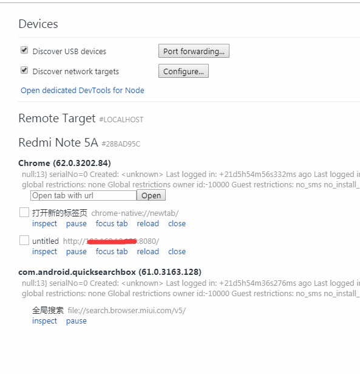

# typescript In react Native

https://github.com/Microsoft/TypeScript-React-Native-Starter

https://github.com/techird/blog/issues/3

## first

```
yarn add --dev typescript
yarn add --dev react-native-typescript-transformer
yarn tsc --init --pretty --jsx react
touch rn-cli.config.js
yarn add --dev @types/react @types/react-native
```

## second

tsconfig.json 文件下解开**allowSyntheticDefaultImports**的 注释

```
{
  ...
  // "allowSyntheticDefaultImports": true,  /* Allow default imports from modules with no default export. This does not affect code emit, just typechecking. */
  ...
}
```

## third

rn-cli.config.js 文件下添加

```
module.exports = {
  getTransformModulePath() {
    return require.resolve("react-native-typescript-transformer");
  },
  getSourceExts() {
    return ["ts", "tsx"];
  }
};
```

## Migrating to TypeScript

Rename the generated `App.js` and `__tests__/App.js` files to `App.tsx`. `index.js` needs to use the `.js` extension. All new files should use the `.tsx` extension (or `.ts` if the file doesn't contain any JSX).

If you try to run the app now, you'll get an error like `object prototype may only be an object or null`. This is caused by a failure to import the default export from React as well as a named export on the same line. Open `App.tsx` and modify the import at the top of the file:

**重新命名生成的 App.js 文件为 App.tsx ,而 index.js 需要用.js 扩展名,此后全部的文件应该使用 .tsx 或者.ts 并且该文件中不包含 JSX**

## Simple example

App.js

```tsx
/**
 * Sample React Native App
 * https://github.com/facebook/react-native
 * @flow
 */

import React, { Component } from "react";
import { Platform, StyleSheet, Text, View } from "react-native";
import Hello from "./src/Hello";

type Props = {};
export default class App extends Component<Props> {
  render() {
    return (
      <View style={styles.container}>
        <Hello name="hengcheng" />
      </View>
    );
  }
}

const styles = StyleSheet.create({
  container: {
    flex: 1,
    justifyContent: "center",
    alignItems: "center",
    backgroundColor: "#F5FCFF"
  },
  welcome: {
    fontSize: 20,
    textAlign: "center",
    margin: 10
  },
  instructions: {
    textAlign: "center",
    color: "#333333",
    marginBottom: 5
  }
});
```

Hello.tsx

```tsx
// components/Hello.tsx
import React from "react";
import { Button, StyleSheet, Text, View } from "react-native";

export interface Props {
  name: string;
}

interface State {}

export default class Hello extends React.Component<Props, State> {
  constructor(props: Props) {
    super(props);
  }

  render() {
    return (
      <View>
        <Text>{this.props.name}</Text>
        <Text>Test Typescript....</Text>
      </View>
    );
  }
}
```

关于编辑器不提示样式的问题解决方法

https://github.com/Microsoft/vscode-react-native/issues/379

封装公共的 styleSheet

```ts
import {
  StyleSheet as RnStyleSheet,
  ViewStyle,
  TextStyle,
  ImageStyle
} from "react-native";

type StyleProps = Partial<ViewStyle | TextStyle | ImageStyle>;

const StyleSheet = {
  create(styles: { [className: string]: StyleProps }) {
    return RnStyleSheet.create(styles);
  },
  hairlineWidth: RnStyleSheet.hairlineWidth
};

export default StyleSheet;
```

## Question

### 1.真机 dedug remote js 调试红屏幕报错

**react native dedug remote js getDeviceId:Neither user 10645**

解决:进入应用授权界面,给所有的权限添加允许

## typescript 封装的简单例子

```tsx
import React from "react";
import {
  TouchableOpacity,
  ActivityIndicator,
  ViewStyle,
  TextStyle,
  StyleSheet
} from "react-native";
/*
  声明传入组件的属性接口....
*/
interface ButtonProp {
  text: string;
  width?: number; //可选
  disabled?: boolean;
  waiting?: boolean;
  style?: ViewStyle | ViewStyle[]; //样式,ViewStyle //或者ViewStyle类型数组
  textStyle?: TextStyle;
  onPress?: () => void;
}
/*
	声明纯组件 :React.SFC
	
*/
export const BorderButton: React.SFC<ButtonProp> = ({
  text,
  disabled,
  waiting,
  style,
  textStyle,
  onPress,
  width = WINDOW.WIDTH - 2 * STYLE_SIZE.SPACING_XW
}) => (
  <TouchableOpacity
    disabled={disabled || waiting}
    onPress={onPress}
    activeOpacity={0.6}
    style={[
      styles.buttonBase,
      { width },
      styles.borderBtn,
      style,
      disabled ? styles.borderDisabled : null
    ]}
  >
    {waiting ? (
      <ActivityIndicator
        size={STYLE_SIZE.FONT_BUTTON_TEXT}
        color={STYLE_COLOR.THEME_BLUE}
      />
    ) : (
      <MText style={[styles.borderText, textStyle]}>{text}</MText>
    )}
  </TouchableOpacity>
);
```

## VSCode 插件

https://zhuanlan.zhihu.com/p/54067071

## Prettier

https://segmentfault.com/a/1190000015315545

// private static host: string = 'http://local.ck.com';

http://graphql.cn/

## react-native-config

全局配置变量,原生皆可使用,在项目中用来控制添加的版本号

https://github.com/luggit/react-native-config

## react-native-DatePicker

https://github.com/xgfe/react-native-datepicker

spinner 模式显示不一致

https://github.com/xgfe/react-native-datepicker/issues/231

手动调用

```
use:
<DatePicker
showIcon={false}
hideText={true}
ref={(ref)=>this.datePickerRef=ref}
...
/>

and from your element:
onPress={() => this.datePickerRef.onPressDate()
```

https://www.jianshu.com/p/6700e0422e6e

## 装饰器

**它的主要作用是给一个已有的方法或类扩展一些新的行为，而不是去直接修改它本身。**

在项目中的使用例子 :

```react
/*
  this.props.navigation.navigate('test',{name:'hengcheng'})
*/
import { withMappedNavigationProps } from 'react-navigation-props-mapper';
@withMappedNavigationProps()
class Test extends Component {
    /*  this.props.navigation.state.params.name  */
    render(){
        return (<View><Text>{this.props.name}</Text></View>)
    }
}
```

还有有个 ant-design-pro 里面的表单注解也有使用到,更方便的操作表单,并获取每个表单组的值

https://zhuanlan.zhihu.com/p/30487077

https://aotu.io/notes/2016/10/24/decorator/index.html

https://segmentfault.com/p/1210000008917067/read

## 修改 git 本地的账号

https://blog.csdn.net/autoliuweijie/article/details/52230165

```
查看
git config user.name
git config user.email
修改
git config --global user.name "username"
git config --global user.email "email"
```

## git

https://segmentfault.com/a/1190000018688048

我从 master 拉取了一个新的开发分支，我想每天把 master 分支上其它人的提交同步到我的开发分支，应该怎么做呢?

```
 git rebase master  // 意思是当前的分支建立在master之上
```

经常有这样的事情发生，当你正在进行项目中某一部分的工作，里面的东西处于一个比较杂乱的状态，而你想转到其他分支上进行一些工作。问题是，你不想提交进行了一半的工作，否则以后你无法回到这个工作点。解决这个问题的办法就是`git stash`命令。

```
git stash  //  vscode 有储藏这一选项
git stash list  // 查看储藏列表
git stash apply  // 运用最新的储藏
git stash drop name   // 删除某个储存
```

https://www.jianshu.com/p/4a8f4af4e803

```
关于 rebase 和 merge
关于什么时候使用 rebase，什么时候使用 merge，开发者总结了几条规则：

从 remote 分支拉取更新到本地时，使用 rebase。
当完成 bug 修复或新功能时，使用 merge 将子分支合并到主分支。
没有人应该 rebase 一根共享的分支。
```

https://www.cnblogs.com/Sinte-Beuve/p/9195018.html

https://zhuanlan.zhihu.com/p/34197548

## LayoutAnimation API

https://segmentfault.com/a/1190000014682665

React 中禁止页面滚动

https://segmentfault.com/a/1190000018598630

https://segmentfault.com/a/1190000018144698

FLex 布局深入理解

https://segmentfault.com/a/1190000017826957

https://segmentfault.com/a/1190000014619371

ALlibaba 图表可视化

## bizcharts

https://github.com/alibaba/BizCharts

https://segmentfault.com/a/1190000018467422

## create-react-app 中使用 less,scss 模块

https://juejin.im/post/5c3c3df451882525153c2352

https://juejin.im/post/5c3d67066fb9a049f06a8323

## eslint+husky+prettier+lint-staged

https://juejin.im/post/5c67fcaae51d457fcb4078c9

这篇文章不错 Eslint+prettier

https://segmentfault.com/a/1190000015862803

## React 中使用 typeScript

https://www.tslang.net/tutorials/react.html

https://juejin.im/post/5c6ad288e51d457fd6233821

```
create-react-app my-app --scripts-version=react-scripts-ts
```

## Node Buffer

https://www.infoq.cn/article/nodejs-about-buffer

## scss 与 sass 后缀名的区别

http://sass.bootcss.com/docs/scss-for-sass-users/

**_.sass 文件的后缀名比较严格,语法跟平常的 css 不同_**
**\*.scss 文件的后缀名语法跟平常的 css 一样,推荐是用.scss 后缀名的\*\***

```
//文件后缀名为sass的语法
    body
      background: #eee
      font-size:12px
    p
      background: #0982c1

    //文件后缀名为scss的语法
    body {
      background: #eee;
      font-size:12px;
    }
    p{
      background: #0982c1;
    }
```

### 如何正确学习 node.js

https://i5ting.github.io/How-to-learn-node-correctly/

#### node 调试方法

https://github.com/i5ting/node-debug-tutorial

### 书籍推荐

https://github.com/ruyuejun/polaris

### vue 项目学习

https://github.com/keepfool/vue-tutorials

### vue 源码解析

https://ustbhuangyi.github.io/vue-analysis/components/lifecycle.html#beforecreate-created

## node.js 的 buffer

https://juejin.im/post/5bbc14406fb9a05d3b3388a0

### chrome 真机调试

1. 确保手机打开调试者模式

2. 手机装有 chrome 浏览器

3. 手机要和电脑在同一个局域网内

4. pc chrome 浏览器 访问 chrome://inspect/#devices

   


**注意点:手机访问本地的项目,需要是 ip 加端口,点击 inspect 打开 devTools**

### 滑动穿透(锁 body)终极探索

https://juejin.im/post/5ca4816e5188250b251e34e9

https://github.com/tuateam/tua-body-scroll-lock

### webPack 实践文章

https://juejin.im/post/59bb37fa6fb9a00a554f89d2

### Node 实战

https://juejin.im/post/5c1f8e52f265da6170071e43#heading-25

## TypeScript 声明文件

> TypeScript 作为 JavaScript 的超集，在开发过程中不可避免要引用其他第三方的 JavaScript 的库。虽然通过直接引用可以调用库的类和方法，但是却无法使用 TypeScript 诸如类型检查等特性功能。为了解决这个问题，需要将这些库里的函数和方法体去掉后只保留导出类型声明，而产生了一个描述 JavaScript 库和模块信息的声明文件。通过引用这个声明文件，就可以借用 TypeScript 的各种特性来使用库文件了.

声明文件的作用,就是为了让不是 typescript 编写的库用上 typescript 的 特性,
declare xxx 说白了就是一套规则.

```typescript
type GreetingLike = string | (() => string) | MyGreeter;
declare function greet(g: GreetingLike): void;
```

> 使用泛型来创建可重用的组件

> 与接口一样，直接把泛型类型放在类后面，可以帮助我们确认类的所有属性都在使用相同的类型

## Web 移动端利用键盘的"搜索" 按钮

https://segmentfault.com/q/1010000002720680
http://www.cnblogs.com/azhw/p/5848208.html

## React-Native 处理不定宽高

<https://linxiaoru.github.io/2017/08/28/react-native-%E4%B8%8D%E5%AE%9A%E5%AE%BD%E9%AB%98%E7%BD%91%E7%BB%9C%E5%9B%BE%E7%89%87%E8%A7%A3%E5%86%B3%E6%96%B9%E6%A1%88/>

## typescript in React

https://blog.csdn.net/ZYC88888/article/details/85047212

https://zhuanlan.zhihu.com/p/37298514

## 正则表达式

https://developer.mozilla.org/zh-CN/docs/Web/JavaScript/Guide/Regular_Expressions

## gitignore 文件的编写规则

https://www.cnblogs.com/jingtyu/p/6831772.html

### BBR 加速

https://www.zhuangold.com/vultr-vps%e4%b8%bb%e6%9c%ba%e5%bf%ab%e9%80%9f%e5%ae%89%e8%a3%85shadowsocks%ef%bc%88ss%ef%bc%89%e6%95%99%e7%a8%8b-2-2/

```
wget –no-check-certificate https://github.com/teddysun/across/raw/master/bbr.sh
 chmod +x bbr.sh
 ./bbr.sh
```

## 如何快速融入一个开发中的项目

Memoization

缓存化函数得到的结果

https://juejin.im/post/5bf7c563e51d452d705fe8d1

### JS 私有属性,方法语法

https://cloud.tencent.com/developer/article/1416872

###

## 关于 React Ref

### 基本使用

某些情况下,我们需要获取组件的实例,或者 react 元素的 Dom 节点,,这个时候就得用到 ref,关于 ref 的基本使用方法有两种:

1. `this.ref=createRef()`
2. `<ReactDom ref={(ref)=>{ref}}/>`

基本使用:https://zh-hans.reactjs.org/docs/refs-and-the-dom.html

### 项目中的使用

最近在做的项目的时候,遇到一个需求.十几个输入框或者选择框组成一个表单域,然后整体对这个"表单域"进行增加.正常思维就是把这个"表单域"封装为一个组件,我就起名为了 SchemeForm ,然后组件内就声明一个方法获取数据 ,就叫**getFormData()**,类的结构大致如下:

```js
class SchemeForm  extends component {
    getFormData(){
        // 此方法进行表单验证,以及获取数据,
    }

    render(){
        ...
    }
}
```

App.js

```js
import React from "react";

class App extends React.Component {
  state = {
    data: [{ name: "aa" }]
  };

  formRefs = [];

  getFormData() {
    // 此方法进行表单验证,以及获取数据,
  }

  add = () => {
    this.formRefs = [];
    this.setState({
      data: data.concat({ name: "bbb" })
    });
  };

  getRef(refs, item) {
    console.log("执行...", refs, item);

    if (refs) {
      this.formRefs.push(refs);
    }
  }
  /*
     此执行结果也一样
    <SchemeForm key={index} ref={this.getRef.bind(this,item)}/>
  */

  render() {
    const { data } = this.state;
    // 保险起见,每次render 函数被调用都重置formRefs
    this.formRefs = [];
    return (
      <div>
        {data.map((item, index) => (
          <SchemeForm
            key={index}
            ref={ref => {
              console.log(ref, item);
              if (ref) {
                this.formRefs.push(ref);
              }
            }}
          />
        ))}
        <button onClick={this.add}>+</button>
      </div>
    );
  }
}
```

日志输出如下:

```js
初入渲染:
  输出(组件的ref,{name:'aa'})
点击+按钮:
  输出(null,{name:'aa'})
  输出(组件的ref,{name:'aa'})
  输出(组件的ref,{name:'bb'})
再次点击:
   输出(null,{name:'aa'})
   输出(null,{name:'bb'})
   输出(组件的ref,{name:'aa'})
   输出(组件的ref,{name:'bb'})
   输出(组件的ref,{name:'bb'})
```

经过观察,里面的回调函数,会执行上一次 render 里面 ref 绑定的回调函数.是在怪哉,不明,但终归动态的获取到了组件的 ref 数组

### 收获

经过折腾得知,ref 里面的回调函数,是在 render 函数之后才执行的,在 componentDidMount 和 compnentDidUpdate 可以获取得到

## Yarn 文档

npm 与 yarn 很有必要重新整理下

<https://yarnpkg.com/zh-Hans/docs/cli/remove

## i18n

<https://www.i18next.com/overview/getting-started>

<https://react.i18next.com/getting-started>

## puppeteer

非常有意思的一个 node 库,与 chrome 通信, 能进行自动化测试,截图,

https://zhuanlan.zhihu.com/p/40103840

<https://github.com/puppeteer/puppeteer>

### useCallback 优化

传递一个函数给组件,容易造成子组件再次渲染,故此我们需要浅比较,所以我们得酌情用上 useCallback 包裹 函数

<https://zhuanlan.zhihu.com/p/56975681>

<https://zhuanlan.zhihu.com/p/92211533>

### react animate library

<https://www.reddit.com/r/reactjs/comments/9kd6cl/animation_library_list/>

<https://github.com/react-spring/react-spring>

### Omit

<https://juejin.im/post/5db159eee51d452a091fdf38>

<https://juejin.im/post/5cffb431f265da1b7401f466>

ScrollreveralJs

<https://scrollrevealjs.org/>

### 自定义滚动条

<https://github.com/malte-wessel/react-custom-scrollbars/issues>

<https://github.com/mdbootstrap/perfect-scrollbar>

<https://github.com/cubiq/iscroll>

### css transform

<https://blog.csdn.net/zyz00000000/article/details/82906528>

https://github.com/k186/pd-select/blob/master/src/components/pdSelect/selectitem.vue

### Three.Js

## 18 个 css animate

<https://codegeekz.com/css-effect-libraries-creating-beautiful-animations/>

## web 中使用苹方字体

<http://note.rpsh.net/posts/2015/11/18/using-pingfang-font-in-website/>

## Bing api

https://bing.lylares.com/detail/jQBq02UY.html

### 浏览器检测

https://github.com/topics/browser-detection

https://github.com/lancedikson/bowser

移动端浏览器侦测

https://github.com/hgoebl/mobile-detect.js/

混淆

RSA 加解密,验证签名

<https://github.com/travist/jsencrypt>

<https://www.jianshu.com/p/8dc4a5f64e06>

### 背景图片像素处理方案

https://juejin.im/post/5b6503dee51d45191e0d30d2#heading-12

## 1px 像素问题?

<https://www.jianshu.com/p/7e63f5a32636>

## React hook 使用

https://juejin.im/post/5d9c5f935188251e3a06bbbb

### 组件间的传值考虑-----

### 文件切片上传原理 值得一看

<https://juejin.im/post/5dff8a26e51d4558105420ed>

### ReactNative Hook

https://github.com/react-native-community/react-native-hooks

### 关于封装自定义 Hooks 总结

### 关于请求

## css 动画库

<https://juejin.im/post/5e24f095e51d45023129baa8>

<https://animista.net/>

<https://dev.to/weeb/10-of-the-best-css-animation-libraries-31d7>

## 图标库

<https://dev.to/weeb/15-of-the-best-and-largest-icon-libraries-4p5n>

## 函数功能单一性

一个函数不能把所有的事情都做了,分解开来....非常要注意

### 封装判断条件

<https://github.com/alivebao/clean-code-js>

## 色素吸取功能的实现

<https://stackoverflow.com/questions/6735470/get-pixel-color-from-canvas-on-mouseover>

<https://segmentfault.com/a/1190000009345753>

## 放大效果实现

<https://juejin.im/post/5d32a0f0f265da1b6f43b103>

## Can't perform a React state update on an unmounted component

相信使用 react 的时候,都会遇到这么个类式如下的警告

Can't perform a React state update on an unmounted component. This is a no-op, but it indicates a memory leak in your application. To fix, cancel all subscriptions and asynchronous tasks in a useEffect cleanup function

大致的意思是,不能在已经卸载的组件上执行 state 的更新操作 ,这是不推荐的操作,在你的应用中可能会内存泄露,修复它,请在 useEffect 清理函数中执行一些操作 .这也是我此处遇到的警告

1.  首页请求接口获取数据,遭遇未授权,返回 302,要求重定向到别的页面
2.  由于重定向到别的页面,当前页面遭到销毁,而后续的更新还在继续,故此报了这么个警告

大致代码如下:

```ts
const loadData = useCallback(
  async (passParams: any) => {
    setLoading(true);

    try {
      const response = await api(passParams);

      setData(response);
    } catch (err) {
      if (err && err.code !== 302) {
        message.warn(err ? err.cnmsg : "服务器端出现错误", 2);
      }
    }
    setLoading(false);
  },
  [api]
);
```

从上述代码中可以看出,即便我已经跳出页面了,还是会执行 setLoading(false);如此会出现警告,解决方案也简单.如下:

```ts
const loadData = useCallback(
  async (passParams: any) => {
    setLoading(true);

    try {
      const response = await api(passParams);

      setData(response);
      setLoading(false);
    } catch (err) {
      if (err && err.code !== 302) {
        message.warn(err ? err.cnmsg : "服务器端出现错误", 2);
        setLoading(false);
      }
    }
  },
  [api]
);
```

在 React Native 中我们也常常遇到,解决也很简单,如下

```jsx
class ExamplePage extends Component {
    mounted=false

    componentDidComponent() {
        this.mounted=true
        fetchData().then(res=>{
            if(this.mounted){
                this.setState(....)
            }
        })
    }

    componentWillUnmount (){
        this.mounted=false
        ....
    }

....

}
```

至于出现了此等情况,容易造成什么危害,详细请看如下链接

https://www.robinwieruch.de/react-warning-cant-call-setstate-on-an-unmounted-component

## Typescipt 新语法,可选的链式翻译(文档)

#### 可选的链式调用

可选链接的核心是,当我们写代码时,当我们遇到 null 或者 undefined ,可以停止运行一些表达式.语法为?.

如下一般

```typescript
let x = foo?.bar.baz();
```

上述代码的意思是,当 foo 被定义,就会执行后续方法,得到的值返回给 x,如果 foot 为 null 或者 undefined,就会直接返回 undefined 给变量 x,更明确的说,下面代码片段也有与此功能

```typescript
let x = foo === null || foo === undefined ? undefined : foo.bar.baz();
```

注意如果 bar 为 null 或者 undefined,我们访问 baz 方法就会 遭遇错误..?仅仅只是检查左边的值,并没有检查余下的属性,故此

```
foo?.bar?.baz()
```

记住**.?**并不同于**&&**,

**&&** 返回 falsy 值

redux 中的 store 说白了,就是一定限制下对应应用的"全局变量",通过某种方式对这个变量进行,增删改.存于某个闭包函数中

### 补充 git

删除远程分支

```
git push -d origin branch-name
```

显示(本地)git 所知道的所有本地和远程分支。

```js
git branch -a
```

若要更新远程分支的本地列表，请执行以下操作：

```js
git remote update origin --prune
```

## React 中的 keep-alive

在开发场景中,我们常常有这样一个需求,页面 A 有一个 Table 列表,我们点击表格中的某一项详情,进入详情页,返回时,页面不刷新,保持原页面数据.

讨论都有 如下链接:

https://github.com/facebook/react/issues/12039

https://github.com/Hzy0913/bolgrepo/issues/41

经查,react 中并没有这样的功能,[vue 中的 keep-alive ](https://cn.vuejs.org/v2/guide/components-dynamic-async.html#%E5%9C%A8%E5%8A%A8%E6%80%81%E7%BB%84%E4%BB%B6%E4%B8%8A%E4%BD%BF%E7%94%A8-keep-alive)与此类式

react 作者大佬有如下两种方案

- 数据与组件分离,缓存需要的数据可以用 redux..每次渲染用已经缓存的数据就好
- 使用样式上的隐藏 display:none

最后作者大佬还对此事盖棺定论, 我们只要单单的保持缓存的数据就足够了,没必要保存整个组件实例.想象一下如果在应用的声明周期保存 N 个缓存的实例,那会是什么样子

而我在项目中采用的是第一种,但也比较麻烦,因为要无时无刻关注页面的缓存数据,什么时候,清除,缓存..关注点太多,代码比较重

也许应该从来从设计层面规避这个问题,

我们可以在页面上弹出一个模态框,来显示信息,这样这个问题也就没有了.

设计与实现产生矛盾时,如果实现麻烦,从设计下手

### CSS position sticky

http://www.w3cbest.com/596.html

### React Context 的使用场景

https://medium.com/@mweststrate/how-to-safely-use-react-context-b7e343eff076

相对应对的组件树而言,是一个全局的变量,运用,有如 redux 和 react-router ,(react-native-element 里的)主题,本地化,路由

组件经过其 Provider

包裹之后,可以访问到 history. dispatch 等数据

```js
export default class WakeUpApp extends React.Component {
  componentDidMount() {
    if (isAndroid()) {
      window.location.href = "cktapp://xx.xx.com";
      setTimeout(function() {
        window.location.href = "https://fir.im/yfckhb";
      }, 2000);
    } else {
      window.location.href =
        "https://itunes.apple.com/cn/app/%E7%95%85%E5%AE%A2%E4%BC%99%E4%BC%B4/id1449233800?mt=8";
    }
  }
  render() {
    return <div></div>;
  }
}
```

```jsx
/**
 * Sample React Native App
 * https://github.com/facebook/react-native
 *
 * @format
 * @flow
 */

import React from 'react';
import {
  SafeAreaView,
  StyleSheet,
  ScrollView,
  View,
  Text,
  StatusBar,
  Button,
} from 'react-native';
import DropdownAlert from 'react-native-dropdownalert';
import {
  Header,
  LearnMoreLinks,
  Colors,
  DebugInstructions,
  ReloadInstructions,
} from 'react-native/Libraries/NewAppScreen';
import Swiper from 'react-native-swiper';
import {
  initialMode,
  DarkModeProvider,
  DynamicStyleSheet,
  DynamicValue,
  useDynamicStyleSheet,
  eventEmitter,
} from 'react-native-dark-mode';
import { WebView } from 'react-native-webview';
eventEmitter.on('currentModeChanged', newMode => {
  console.log('Switched to', newMode, 'mode');
});
const dynamicStyles = new DynamicStyleSheet({
  container: {
    backgroundColor: new DynamicValue('white', 'black'),
    flex: 1,
  },
  text: {
    color: new DynamicValue('black', 'white'),
    textAlign: 'center',
  },
});
console.log('App started in', initialMode, 'mode');
const TestComponent = () => {
  const styles = useDynamicStyleSheet(dynamicStyles);
  return (
    <View style={styles.container}>
      <Text style={styles.text}>第三方是的范德萨</Text>
    </View>
  );
};

const Test2 = () => (
  <View>
    <Text>测试第二个</Text>
  </View>
);

/*
// 返回 爆率出返回键的按钮监听事件?
<Swiper style={styles.wrapper} showsButtons={true} horizontal={false}>
          <View style={styles.slide1}>
            <Text style={styles.text}>Hello Swiper</Text>
          </View>
          <View style={styles.slide2}>
            <Text style={styles.text}>Beautiful</Text>
          </View>
        </Swiper>http://192.168.10.199:3006/applyHome
        https://github.com/react-native-community/react-native-webview/issues/24
        其实我只要一个状态罢了,就是可以不可以返回
*/

class App extends React.Component {
  webViewRef = null;
  state = {
    pushCount: 0,
  };

  render() {
    return (
      <React.Fragment>
        <Button
          title={`返回${this.state.pushCount}`}
          onPress={() => {
            this.webViewRef.goBack();
          }}
        />
        <WebView
          ref={ref => {
            this.webViewRef = ref;
          }}
          style={{ flex: 1 }}
          source={{ uri: 'http://192.168.10.199:3006/applyHome' }}
          onNavigationStateChange={navState => {
            // Keep track of going back navigation within component
            this.canGoBack = navState.canGoBack;
            console.log(navState);
          }}
          injectedJavaScript={`
            (function() {
              function wrap(fn) {
                return function wrapper() {
                  var res = fn.apply(this, arguments);
                
                    window.ReactNativeWebView.postMessage(window.location.href);
                
                  return res;
                }
              }
              history.pushState = wrap(history.pushState);
              history.back= wrap(history.pushState,'back')
              history.replaceState = wrap(history.replaceState);
              window.addEventListener('popstate', function() {
                window.ReactNativeWebView.postMessage('back');
              });
            })();
            true;
  `}
          onMessage={({ nativeEvent: state }) => {
            console.log(state.data);
            if (state.data === 'back') {
              this.setState({
                pushCount: this.state.pushCount - 1,
              });
            } else {
              this.setState({
                pushCount: this.state.pushCount + 1,
              });
            }
          }}
        />

        <DropdownAlert ref={ref => (this.dropDownAlertRef = ref)} />
      </React.Fragment>
    );
  }
}
// https://github.com/react-native-community/react-native-webview/issues/24#issuecomment-466546563
const styles = StyleSheet.create({
  wrapper: {},
  slide1: {
    flex: 1,
    justifyContent: 'center',
    alignItems: 'center',
    backgroundColor: '#9DD6EB',
  },
  slide2: {
    flex: 1,
    justifyContent: 'center',
    alignItems: 'center',
    backgroundColor: '#97CAE5',
  },
  slide3: {
    flex: 1,
    justifyContent: 'center',
    alignItems: 'center',
    backgroundColor: '#92BBD9',
  },
  text: {
    color: '#fff',
    fontSize: 30,
    fontWeight: 'bold',
  },
});

export default App;

/*
  react native webView 中长按图片,不弹出菜单栏,android 没反应,ios 13 似乎不工作
  所以说在react native webView 中分享和保存图片,只能由通过调用APP封装的功能,来达到目的

  react native webView 配合 SPA 页面

  从没考虑过在 App 的 webView 中 加载 SPA,今天加载,发现,设备中的物理返回键,需要进行处理,
  而已react-route 中的 push()改变路由操作,触发不了onNavigationStateChange,折中的方案就是
  注入监听代码,通过postMessage()回传给webView 的 onMessage(),然后保存一个状态进行处理

*/

```

